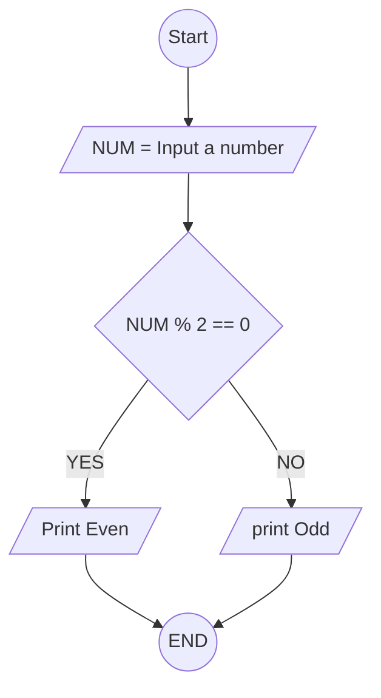

## 1. Check Even or Odd Number

Design an algorithm and flowchart that take a number as input and
determine whether it is even or odd.

### ✔ Pseudocode

```
START
  INPUT number
  IF number % 2 == 0
      PRINT Even
  ELSE
      PRINT Odd
  ENDIF
END
```

### ✔ Flowchart


