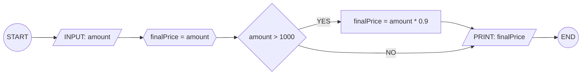
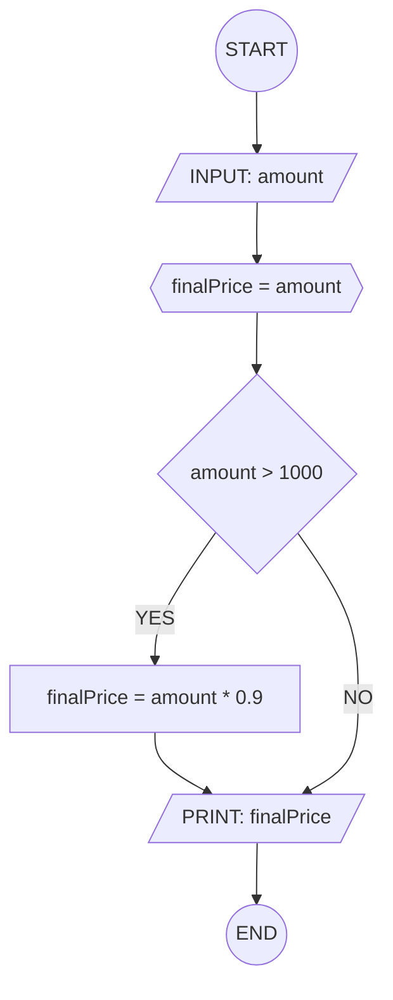

## 10. Calculate Discount on Purchase

Write the algorithm and draw the flowchart for a program that inputs the
purchase amount and gives a **10% discount** if the amount is greater
than 1000.

---

### ✔ Pseudocode

```
START
  INPUT: amount
  SET: finalPrice = amount
  IF: amount > 1000
    finalPrice = amount * 0.9
  ENDIF
  OUT: print finalPrice
END
```

### ✔ Flowchart




