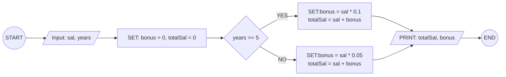
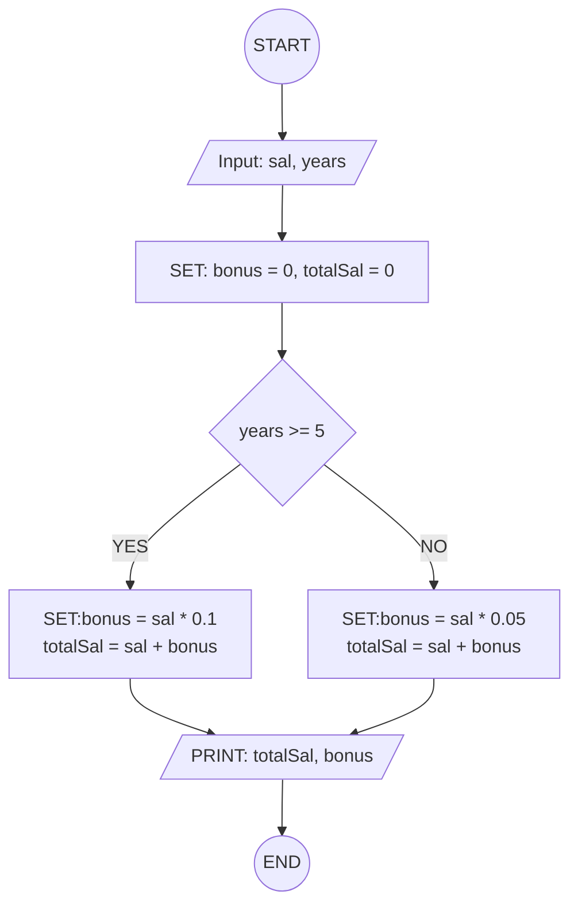

## 12. Employee Salary and Bonus Calculator

Write the algorithm and draw the flowchart for a program that inputs an
employee's monthly salary and years of service, calculates a bonus of
**10%** for employees with 5 or more years of service and **5%** for
others, then displays the bonus and total salary.

---

### ✔ Pseudocode

```
START
  INPUT: sal, years
  SET: bonus, totalSal
  IF: years >= 5
    bonus = sal * 0.1
  ELSE:
    bonus = sal * 0.05
  ENDIF
  totalSal = sal * 09
  PRINT: totalSal, bonus
END
```

### ✔ Flowchart




