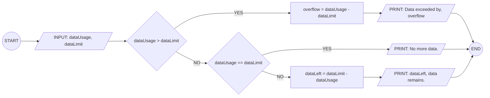
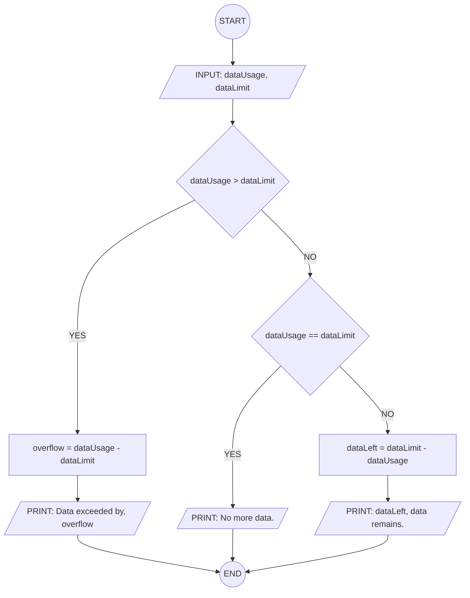

## 13. Mobile Data Usage Monitor

Write the algorithm and draw the flowchart for a program that inputs a
user's monthly data limit and data usage, then displays whether the user
has exceeded the limit or how much data remains.

---

### ✔ Pseudocode

```
START
  INPUT: dataLimit, dataUsage
  IF: dataUsage > dataLimit
    CALC: overflow = dataUsage - dataLimit
    PRINT: You have exceeded the data limit by, overflow
  ELSEIF: dataUsage == dataLimit
    PRINT: You have no more data.
  ELSE:
    CALC: dataLeft = dataLimit - dataUsage
    PRINT: dataLeft, data remains.
  ENDIF
END
```

### ✔ Flowchart




