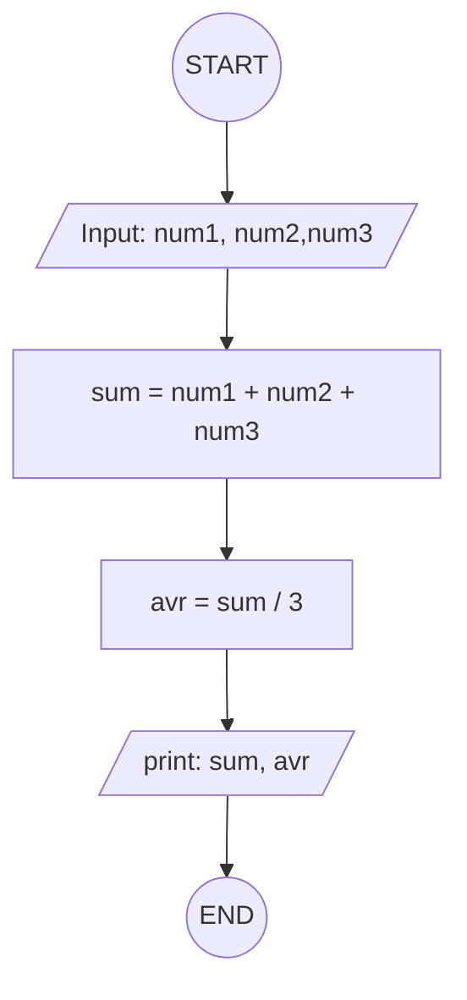

## 2. Calculate Total and Average Marks

Write the algorithm and draw the flowchart for a program that inputs
marks for 3 subjects, calculates the total and average, and displays
both.

### ✔ Pseudocode

```
START
  INPUT num1, num2, num3
  SET sum = num1 + num2 + num3
  SET avr = sum / 3
  OUTPUT sum, avr
END
```

### ✔ Flowchart


