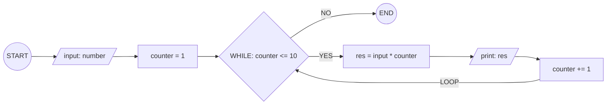
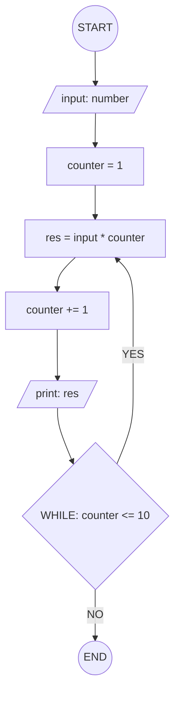

## 3. Display Multiplication Table

Create an algorithm and flowchart that input a number and display its
multiplication table from 1 to 10 using a loop.

---

### ✔ Pseudocode

```
START
  INPUT number
  SET counter 1
  WHILE counter <= 10
     set res = number * counter
     print res
     counter += 1
  ENDWHILE
END
```

### ✔ Flowchart




