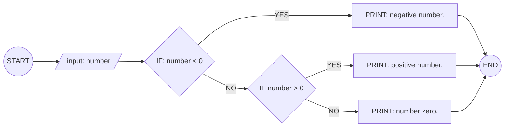
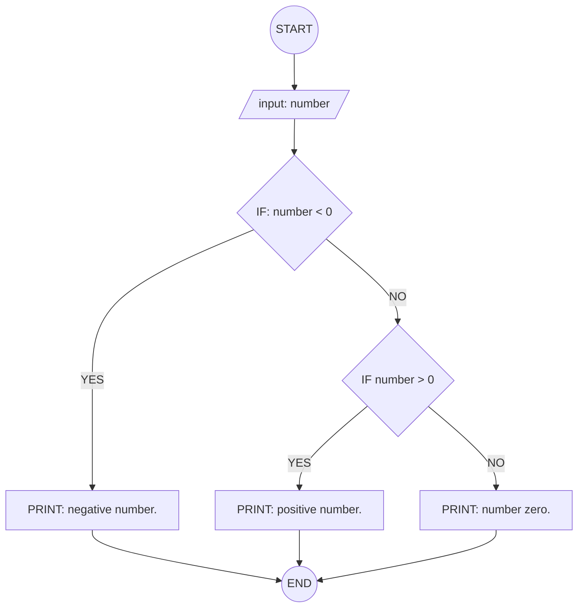

## 4. Positive, Negative, or Zero Check

Write the algorithm and flowchart to input a number and display whether
it is positive, negative, or zero.

---

### ✔ Pseudocode

```
START
  INPUT: number
  IF number < 0
    PRINT: negative
  ELSEIF: number > 0
    PRINT: positive
  ELSE
PRINT: zero
  ENDIF
END
```

### ✔ Flowchart




