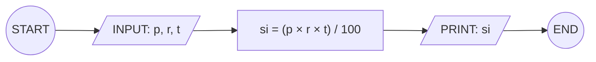

## 5. Simple Interest Calculator

Create an algorithm and flowchart for a program that calculates simple
interest using the formula:

**si = (p × r × t) / 100**

- **p = principal** → original amount of money
- **r = rate of interest** → percentage per year
- **t = time** → number of years

---

**input style:**
### ✔ Pseudocode

```
START
input: p = original amount of money,
r = rate of interest,
t = time in years
SET si = (p × r × t) / 100
PRINT: si
END
```

### ✔ Flowchart



```mermaid
flowchart TD
```
