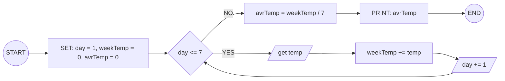
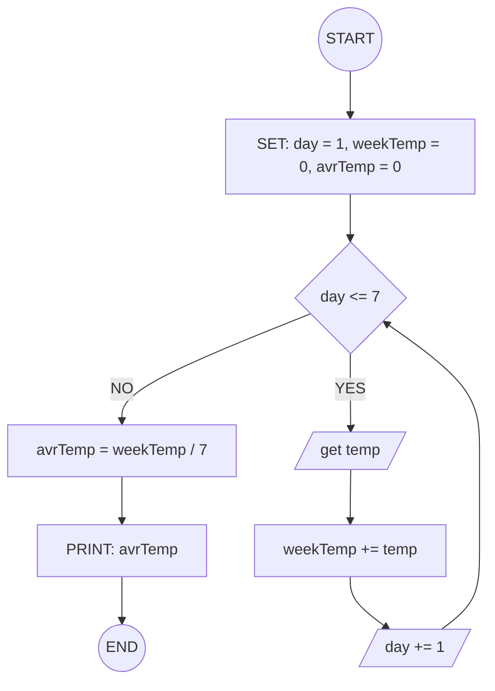

## 6. Average Temperature Calculation

Write the algorithm and draw the flowchart for a program that takes the
temperature of 7 days, finds the average temperature, and displays it.

---

**input style:**

### ✔ Pseudocode

```
START
  SET day = 1
  SET weekTemp = 0
  SET avrTemp = 0
  WHILE day <= 7
    INPUT temp
    CALC weekTemp += temp
    day += 1
  ENDWHILE
  SET avrTemp = weekTemp / 7
  PRINT avrTemp
END
```

### ✔ Flowchart




