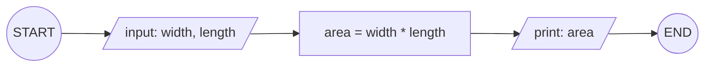
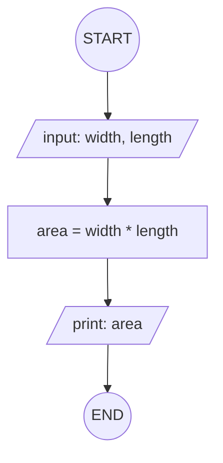

## 7. Calculate Area of a Rectangle

Create an algorithm and flowchart to input length and width, calculate
the area (**Area = Length × Width**), and display the result.

---

**input style:**

### ✔ Pseudocode

```
START
  INPUT: width, length
  SET area = width * length
  OUTPUT: area
END
```

### ✔ Flowchart




