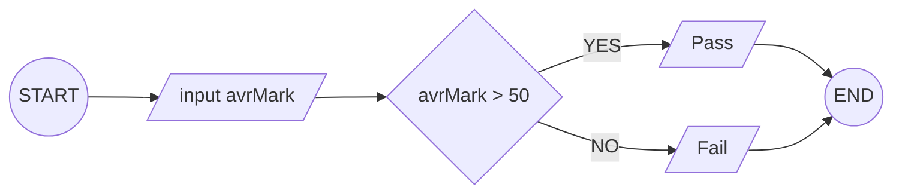
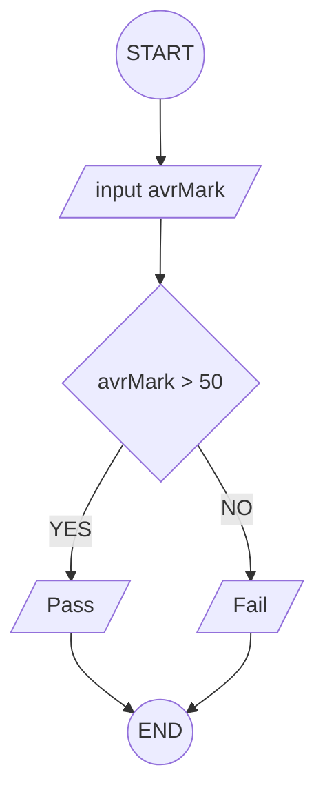

## 8. Determine Pass or Fail

Write the algorithm and draw the flowchart for a program that takes a
student's average marks and displays **"Pass"** if average ≥ 50,
otherwise **"Fail"**.

---

**input style:**

### ✔ Pseudocode

```
START
INPUT: avrMark
  IF avrMark > 50
    PRINT: Pass
  ELSE
    PRINT: Fail
  ENDIF
END
```

### ✔ Flowchart




