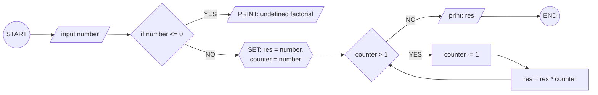
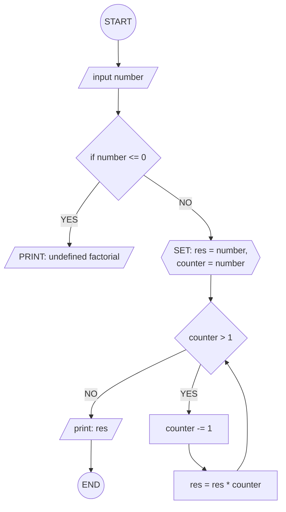

## 9. Calculate Factorial of a Number

Write the algorithm and draw the flowchart that input a number and
calculate its factorial using a loop.

---

**input style:**

### ✔ Pseudocode

```
START
  IN[/number/]
  IF number <= 0
    PRINT: undefined factorial.
  ELSE
    SET: res = number
    SET: counter = number
    WHILE counter > 1
      counter -= 1
      res = res * counter
    ENDWHILE
    PRINT: res
  ENDIF
END
```

### ✔ Flowchart




